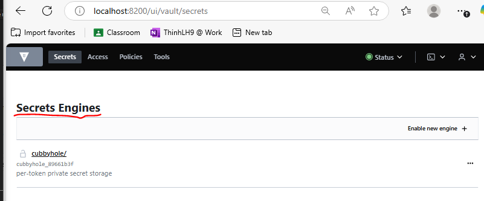
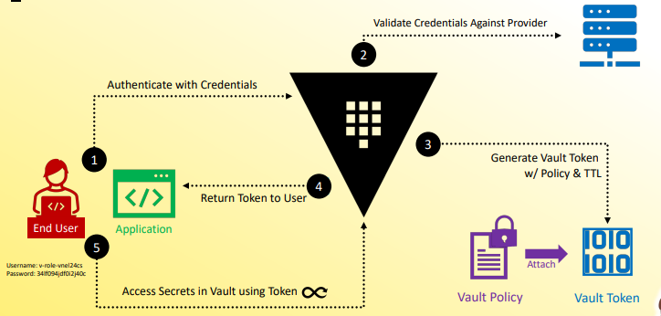
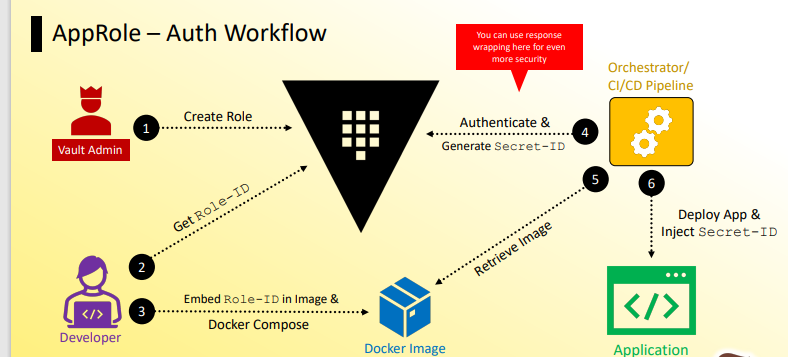

# Vault Secret Management
- [Vault Secret Management](#vault-secret-management)
  - [What is the architecture of Vault HashiCorp and what are the main components of Vault?](#what-is-the-architecture-of-vault-hashicorp-and-what-are-the-main-components-of-vault)
  - [What is Secret Engines? What are the most common secret types?](#what-is-secret-engines-what-are-the-most-common-secret-types)
    - [**What is a Secret Engine in Vault?**](#what-is-a-secret-engine-in-vault)
    - [**Most Common Secret Types in Vault**](#most-common-secret-types-in-vault)
  - [What is the main difference between **`static secrets`** and **`dynamic secrets`**?](#what-is-the-main-difference-between-static-secrets-and-dynamic-secrets)
    - [**1. Static Secrets**](#1-static-secrets)
    - [**2. Dynamic Secrets**](#2-dynamic-secrets)
    - [**Key Differences**](#key-differences)
  - [Explain me the detail data below from `vault secrets list`:](#explain-me-the-detail-data-below-from-vault-secrets-list)
    - [**1. `cubbyhole/` (Cubbyhole Secrets Engine)**](#1-cubbyhole-cubbyhole-secrets-engine)
    - [**2. `identity/` (Identity Secrets Engine)**](#2-identity-identity-secrets-engine)
    - [**3. `sys/` (System Namespace)**](#3-sys-system-namespace)
    - [**Why Does This Matter?**](#why-does-this-matter)
    - [**1. `cubbyhole/` (Cubbyhole Secrets Engine)**](#1-cubbyhole-cubbyhole-secrets-engine-1)
    - [**2. `identity/` (Identity Secrets Engine)**](#2-identity-identity-secrets-engine-1)
    - [**3. `sys/` (System Namespace)**](#3-sys-system-namespace-1)
    - [**Why Does This Matter?**](#why-does-this-matter-1)
  - [What is Vault Authen Methods?](#what-is-vault-authen-methods)
    - [**🔹 Token Authentication**](#-token-authentication)
    - [**🔹 Username \& Password (`userpass`)**](#-username--password-userpass)
    - [**🔹 AppRole Authentication**](#-approle-authentication)
    - [**🔹 Kubernetes Authentication**](#-kubernetes-authentication)
    - [**🔹 Cloud Authentication**](#-cloud-authentication)
    - [**🔹 GitHub Authentication**](#-github-authentication)
    - [**🔹 LDAP Authentication**](#-ldap-authentication)
    - [**🔹 Okta Authentication**](#-okta-authentication)
    - [**🔹 JWT/OIDC Authentication**](#-jwtoidc-authentication)
    - [**🔹 Cert Authentication**](#-cert-authentication)
    - [**🔹 Radius Authentication**](#-radius-authentication)
  - [What is the difference between `System-based` and `Human-based` Authen Mode?](#what-is-the-difference-between-system-based-and-human-based-authen-mode)
    - [**🔹 System-Based Authentication (Machine-to-Machine)**](#-system-based-authentication-machine-to-machine)
    - [**🔹 Human-Based Authentication (User-to-System)**](#-human-based-authentication-user-to-system)
    - [**🔹 Key Differences**](#-key-differences)
  - [What is Vault namespace?](#what-is-vault-namespace)
    - [**Key Features of Vault Namespaces**](#key-features-of-vault-namespaces)
    - [**Example Namespace Structure**](#example-namespace-structure)
    - [**Key Features of Vault Namespaces**](#key-features-of-vault-namespaces-1)
    - [*Example Namespace Structure*](#example-namespace-structure-1)
    - [**Namespace Naming Rules**](#namespace-naming-rules)
  - [What is the difference between `cluster_addr` and `api_addr`?](#what-is-the-difference-between-cluster_addr-and-api_addr)
    - [**1. `api_addr` (API Address)**](#1-api_addr-api-address)
    - [**2. `cluster_addr` (Cluster Address)**](#2-cluster_addr-cluster-address)
    - [**Key Difference**](#key-difference)
  - [What are the Secret Engines types in Vault?](#what-are-the-secret-engines-types-in-vault)
    - [**🔹 Key/Value (KV) Secrets Engine**](#-keyvalue-kv-secrets-engine)
    - [**🔹 Database Secrets Engine**](#-database-secrets-engine)
    - [**🔹 Identity Secrets Engine**](#-identity-secrets-engine)
    - [**🔹 Transit Secrets Engine**](#-transit-secrets-engine)
    - [**🔹 PKI (Public Key Infrastructure) Secrets Engine**](#-pki-public-key-infrastructure-secrets-engine)
    - [**🔹 Cubbyhole Secrets Engine**](#-cubbyhole-secrets-engine)
    - [**🔹 AWS, Azure, and GCP Secrets Engines**](#-aws-azure-and-gcp-secrets-engines)
    - [**🔹 SSH Secrets Engine**](#-ssh-secrets-engine)
    - [**🔹 LDAP Secrets Engine**](#-ldap-secrets-engine)

## What is the architecture of Vault HashiCorp and what are the main components of Vault?
1. **Core Components**:
   - **Storage Backend**: Vault relies on storage backends (such as Consul, AWS S3, or PostgreSQL) to persist encrypted data.
   - **Barrier**: A cryptographic barrier that protects sensitive data using encryption.
   - **Seal & Unseal Process**: Vault must be unsealed before it can operate, requiring multiple key shares.
   - **Authentication**: Supports various methods like GitHub, LDAP, Kubernetes, and AWS IAM.
   - **Policies**: Defines access control rules using ACLs (Access Control Lists).

2. **High Availability and Scalability**:
   - Vault can be deployed in **high-availability mode**, allowing multiple Vault instances to work together.
   - It supports **auto-scaling** for large infrastructures.

3. **Secrets Engines**:
   - Manage secrets like passwords, certificates, and API keys.
   - Popular engines include KV (key-value), PKI (certificate management), and database credentials rotation.

4. **Audit Logs**:
   - Provides detailed logs to track access and activities.
   - Essential for compliance and security monitoring.

## What is Secret Engines? What are the most common secret types?

### **What is a Secret Engine in Vault?**
A **Secret Engine** in HashiCorp Vault is a component that **stores, generates, or encrypts** data. It acts as a **plugin** that provides different ways to manage secrets, such as passwords, API keys, certificates, and encryption keys.

Secret Engines are enabled at specific paths in Vault, and they function like a **virtual filesystem**, allowing operations like **read, write, and delete**.


### **Most Common Secret Types in Vault**
Vault supports various types of secrets through different Secret Engines. Here are some of the most commonly used:

1. **Key/Value (KV) Secrets Engine**  
   - Stores **static secrets** like API keys, passwords, and configuration values.
   - Supports **versioning** (KV v2) for secret history and rollback.

2. **Database Secrets Engine**  
   - Generates **dynamic credentials** for databases like MySQL, PostgreSQL, and MongoDB.
   - Credentials **expire automatically**, reducing security risks.

3. **Identity Secrets Engine**  
   - Manages **user identities** and authentication methods.
   - Helps unify multiple authentication sources.

4. **Transit Secrets Engine**  
   - Provides **encryption as a service** for applications.
   - Encrypts and decrypts data without storing it.

5. **PKI (Public Key Infrastructure) Secrets Engine**  
   - Issues and manages **TLS certificates**.
   - Acts as a **certificate authority (CA)**.

6. **Cubbyhole Secrets Engine**  
   - Stores **temporary secrets** that are only accessible by the token that created them.
   - Used for **secure response wrapping**.



These Secret Engines allow Vault to handle **both static and dynamic secrets**, ensuring **secure access management**.

## What is Authentication Method Workflow using Vault for Application and User?




## What is the AppRole Authen Methods Workflow




## What is the main difference between **`static secrets`** and **`dynamic secrets`**?
The main difference between **static** and **dynamic secrets** is how they are managed and used within Vault:

### **1. Static Secrets**
- **Manually stored** and managed in Vault.
- Remain the **same until explicitly changed**.
- Commonly used for **API keys, passwords, certificates, and config values**.
- Typically stored using the **Key/Value (KV) Secrets Engine**.

✅ Example:  
A stored API key in Vault:
```sh
vault kv put secret/api API_KEY="my-static-api-key"
```
This key remains valid until someone updates or deletes it.


### **2. Dynamic Secrets**
- **Automatically generated** when requested.
- Have a **limited lifetime** (expire after use or after a set TTL).
- Used for **database credentials, cloud access tokens, SSH credentials**.
- Vault **creates them on demand** and **revokes access** when they expire.
- Managed by Secret Engines like **Database, PKI, and SSH**.

✅ Example:  
Vault **dynamically generates** database credentials:
```sh
vault read database/creds/my-role
```
This command creates **temporary credentials** for accessing a database.


### **Key Differences**
| Feature         | Static Secrets | Dynamic Secrets |
|----------------|---------------|----------------|
| Storage Type   | Manually stored | Generated on request |
| Expiration     | Never expires unless manually changed | Automatically expires (TTL) |
| Security Risk  | Risk of exposure if mismanaged | Lower risk due to short lifespan |
| Example Usage  | API keys, passwords, certificates | Database credentials, SSH keys |

Dynamic secrets enhance **security and automation**, while static secrets offer **simple storage for fixed values**.

## Explain me the detail data below from `vault secrets list`:

```text
Path          Type         Accessor              Description
----          ----         --------              --------cubbyhole/    cubbyhole    cubbyhole_89661b3f    per-token private secret storage
identity/     identity     identity_3996cd56     identity store
sys/          system       system_22bc71fc       system endpoints used for control, policy and debugging
```

This output represents different **Vault namespaces** where secrets and system-related data are stored. Here’s a breakdown:

### **1. `cubbyhole/` (Cubbyhole Secrets Engine)**
- **Type:** `cubbyhole`
- **Accessor:** `cubbyhole_89661b3f`
- **Description:** **Per-token private storage** — secrets stored here are only accessible by the Vault token that created them.
- **Use Case:** Temporary secrets like short-lived API keys.

✅ **Security Advantage:** Secrets in `cubbyhole/` disappear when the token expires, making it **impossible for other tokens** to access them.


### **2. `identity/` (Identity Secrets Engine)**
- **Type:** `identity`
- **Accessor:** `identity_3996cd56`
- **Description:** **Identity store** used for managing **entities**, **groups**, and associated metadata within Vault.
- **Use Case:** Enables **single sign-on (SSO)**, user/group management, and identity-based access control.

✅ **Security Advantage:** Centralized management of users and authentication across Vault.


### **3. `sys/` (System Namespace)**
- **Type:** `system`
- **Accessor:** `system_22bc71fc`
- **Description:** Contains **administrative endpoints** for controlling Vault, managing policies, and debugging.
- **Use Case:** Used for tasks like **checking Vault status**, managing policies, configuring audits, and unsealing Vault.

✅ **Security Advantage:** Restricted to privileged users with admin access.


### **Why Does This Matter?**
- **Each path serves a distinct purpose in Vault**, ensuring **secrets, identity management, and system configurations** are properly organized.
- **Cubbyhole is short-lived**, **Identity ensures centralized access**, and **Sys is for admins**.

Would you like help configuring access policies for these paths? 🚀
This output represents different **Vault namespaces** where secrets and system-related data are stored. Here’s a breakdown:

### **1. `cubbyhole/` (Cubbyhole Secrets Engine)**
- **Type:** `cubbyhole`
- **Accessor:** `cubbyhole_89661b3f`
- **Description:** **Per-token private storage** — secrets stored here are only accessible by the Vault token that created them.
- **Use Case:** Temporary secrets like short-lived API keys.

✅ **Security Advantage:** Secrets in `cubbyhole/` disappear when the token expires, making it **impossible for other tokens** to access them.


### **2. `identity/` (Identity Secrets Engine)**
- **Type:** `identity`
- **Accessor:** `identity_3996cd56`
- **Description:** **Identity store** used for managing **entities**, **groups**, and associated metadata within Vault.
- **Use Case:** Enables **single sign-on (SSO)**, user/group management, and identity-based access control.

✅ **Security Advantage:** Centralized management of users and authentication across Vault.


### **3. `sys/` (System Namespace)**
- **Type:** `system`
- **Accessor:** `system_22bc71fc`
- **Description:** Contains **administrative endpoints** for controlling Vault, managing policies, and debugging.
- **Use Case:** Used for tasks like **checking Vault status**, managing policies, configuring audits, and unsealing Vault.

✅ **Security Advantage:** Restricted to privileged users with admin access.

### **Why Does This Matter?**
- **Each path serves a distinct purpose in Vault**, ensuring **secrets, identity management, and system configurations** are properly organized.
- **Cubbyhole is short-lived**, **Identity ensures centralized access**, and **Sys is for admins**.

## What is Vault Authen Methods?
Vault supports multiple **authentication methods** to verify users and applications before granting access. Here are the main types:

### **🔹 Token Authentication**
- Default method in Vault.
- Uses **Vault-generated tokens** for authentication.
- Supports **renewable and non-renewable tokens**.

### **🔹 Username & Password (`userpass`)**
- Simple authentication using **static credentials**.
- Best for **human users** in small environments.

### **🔹 AppRole Authentication**
- Uses **role-based authentication** for applications.
- Supports **secret IDs and role IDs** for secure access.

### **🔹 Kubernetes Authentication**
- Allows **Kubernetes pods** to authenticate using **ServiceAccount tokens**.
- Ideal for **Kubernetes-native applications**.

### **🔹 Cloud Authentication**
- **AWS** Authentication:
   - Uses **AWS IAM roles** to authenticate Vault requests.
   - Supports **EC2 instance metadata** and **IAM policies**.
- **Azure** Authentication:
   - Uses **Azure Managed Identities** for authentication.
   - Ideal for **Azure-hosted applications**.
- **GCP** Authentication:
   - Uses **Google Cloud IAM** for authentication.
   - Supports **service accounts and workload identity federation**.

### **🔹 GitHub Authentication**
- Allows users to authenticate using **GitHub OAuth tokens**.
- Best for **teams using GitHub for identity management**.

### **🔹 LDAP Authentication**
- Integrates with **LDAP directories** for authentication.
- Ideal for **enterprise environments**.

### **🔹 Okta Authentication**
- Uses **Okta OAuth tokens** for authentication.
- Best for **organizations using Okta for identity management**.

### **🔹 JWT/OIDC Authentication**
- Uses **JSON Web Tokens (JWT)** or **OpenID Connect (OIDC)**.
- Ideal for **modern authentication workflows**.

### **🔹 Cert Authentication**
- Uses **TLS certificates** for authentication.
- Best for **secure, certificate-based access**.

### **🔹 Radius Authentication**
- Uses **RADIUS protocol** for authentication.
- Suitable for **network-based authentication**.

For more details, check out the [Vault Authentication Methods documentation](https://developer.hashicorp.com/vault/docs/auth).


## What is the difference between `System-based` and `Human-based` Authen Mode?

The difference between **System-based authentication** and **Human-based authentication** lies in **who** or **what** is performing the authentication and **how credentials are managed**.

### **🔹 System-Based Authentication (Machine-to-Machine)**
✅ **Used by applications, services, or automated processes.**  
✅ Typically involves **API keys, tokens, AppRoles, or TLS certificates**.  
✅ Authentication is **automated**, requiring **no human input**.  
✅ Examples in **Vault**:
   - **AppRole authentication** (for applications needing secure access).
   - **Kubernetes authentication** (pods authenticate using service accounts).
   - **AWS IAM authentication** (machines get temporary credentials automatically).


### **🔹 Human-Based Authentication (User-to-System)**
✅ **Used by humans logging in manually.**  
✅ Often involves **passwords, multi-factor authentication (MFA), or OAuth tokens**.  
✅ Requires **human interaction** to enter credentials.  
✅ Examples in **Vault**:
   - **Userpass authentication** (username/password login).
   - **GitHub authentication** (users authenticate via GitHub OAuth).
   - **LDAP authentication** (users login via an enterprise directory).

### **🔹 Key Differences**
| Feature              | System-Based Authentication | Human-Based Authentication |
|----------------------|---------------------------|---------------------------|
| **Who Authenticates?** | Machines, services, apps | Human users |
| **Credential Type** | API keys, tokens, TLS certs | Passwords, MFA, OAuth |
| **Interaction Required?** | ❌ No manual input | ✅ User enters credentials |
| **Best For** | Automation, microservices, API security | User logins, admin access |


## What is Vault namespace?

A **Vault namespace** is a feature in **Vault Enterprise** that enables **secure multi-tenancy (SMT)** by creating isolated environments within a single Vault instance. Each namespace functions like a **mini-Vault**, allowing different teams or tenants to manage their own secrets, authentication methods, and policies independently.

### **Key Features of Vault Namespaces**
- **Tenant Isolation** → Each namespace has its own secrets, policies, and authentication methods.
- **Delegated Administration** → Vault admins can assign control over specific namespaces.
- **Hierarchical Structure** → Namespaces can have **child namespaces**, inheriting policies from parent namespaces.
- **Separate Login Paths** → Users authenticate within their assigned namespace.

### **Example Namespace Structure**
A **Vault namespace** is a feature in **Vault Enterprise** that enables **secure multi-tenancy (SMT)** by creating isolated environments within a single Vault instance. Each namespace functions like a **mini-Vault**, allowing different teams or tenants to manage their own secrets, authentication methods, and policies independently.

### **Key Features of Vault Namespaces**
- **Tenant Isolation** → Each namespace has its own secrets, policies, and authentication methods.
- **Delegated Administration** → Vault admins can assign control over specific namespaces.
- **Hierarchical Structure** → Namespaces can have **child namespaces**, inheriting policies from parent namespaces.
- **Separate Login Paths** → Users authenticate within their assigned namespace.

### *Example Namespace Structure*
```
root/
 ├── teamA/
 │   ├── dev/
 │   ├── prod/
 ├── teamB/
 │   ├── staging/
 │   ├── prod/
```
- `teamA/dev` and `teamA/prod` are **child namespaces** of `teamA`.
- `teamB/staging` and `teamB/prod` are **child namespaces** of `teamB`.

### **Namespace Naming Rules**
- Cannot end with `/`
- Cannot contain spaces
- Cannot use reserved names like `root`, `sys`, `audit`, `auth`, `cubbyhole`, or `identity`.


## What is the difference between `cluster_addr` and `api_addr`?
### **1. `api_addr` (API Address)**
- This is the **external address** that clients use to interact with Vault.
- It is where API requests are sent.
- Typically set to a **public or load-balanced address**.
- Example:
  ```hcl
  api_addr = "https://vault.example.com:8200"
  ```
- If a standby node receives a request, it may **redirect** the client to the active node using this address.

### **2. `cluster_addr` (Cluster Address)**
- This is used for **internal communication** between Vault nodes.
- It allows Vault servers to talk to each other in a **high-availability (HA) setup**.
- Typically set to a **private IP or hostname**.
- Example:
  ```hcl
  cluster_addr = "https://10.0.0.1:8201"
  ```
- Vault nodes use this address to **sync state and forward requests**.

### **Key Difference**
- **`api_addr`** is for **external clients** (users, applications).
- **`cluster_addr`** is for **internal Vault node communication**.


## What are the Secret Engines types in Vault?

Vault supports multiple **secrets engines**, each designed for different use cases. Here are some of the most common types:

### **🔹 Key/Value (KV) Secrets Engine**
- Stores **generic secrets** (passwords, API keys, etc.).
- Supports **versioning** (KV v2).
- Example: `vault kv put secret/my-secret username="admin" password="SuperSecure123"`

### **🔹 Database Secrets Engine**
- Dynamically generates **database credentials**.
- Supports **MySQL, PostgreSQL, MSSQL, etc.**.
- Example: `vault write database/roles/my-role db_name=my-db creation_statements="CREATE USER '{{name}}' WITH PASSWORD '{{password}}';"`

### **🔹 Identity Secrets Engine**
- Manages **identity-based authentication**.
- Supports **OIDC, JWT, and role-based access**.

### **🔹 Transit Secrets Engine**
- Provides **encryption as a service**.
- Encrypts and decrypts data **without storing it**.
- Example: `vault write transit/encrypt/my-key plaintext=$(base64 <<< "my-secret-data")`

### **🔹 PKI (Public Key Infrastructure) Secrets Engine**
- Issues and manages **TLS certificates**.
- Acts as a **certificate authority (CA)**.
- Example: `vault write pki/issue/my-role common_name="example.com"`

### **🔹 Cubbyhole Secrets Engine**
- Stores **temporary secrets** per session.
- Secrets **expire** when the session ends.

### **🔹 AWS, Azure, and GCP Secrets Engines**
- Dynamically generates **cloud credentials**.
- Supports **IAM roles and service accounts**.

### **🔹 SSH Secrets Engine**
- Manages **SSH key signing**.
- Provides **one-time SSH credentials**.

### **🔹 LDAP Secrets Engine**
- Manages **LDAP credentials** dynamically.

For a full list, check out the [Vault Secrets Engine documentation](https://developer.hashicorp.com/vault/docs/commands/secrets/list)