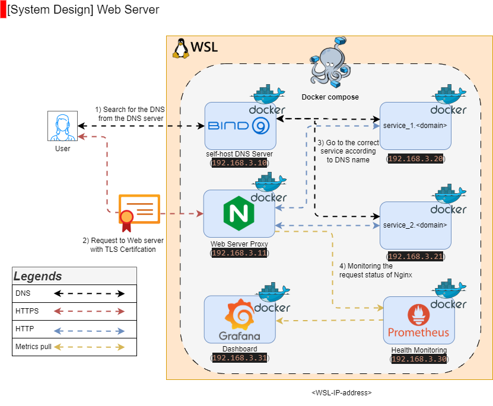
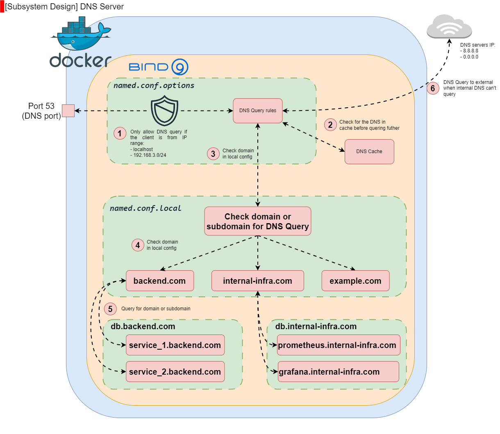
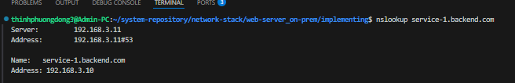
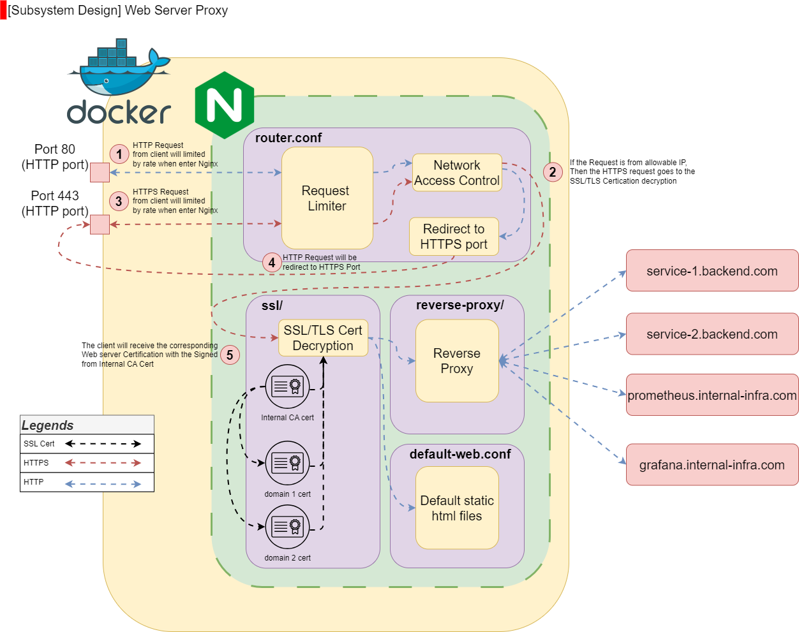
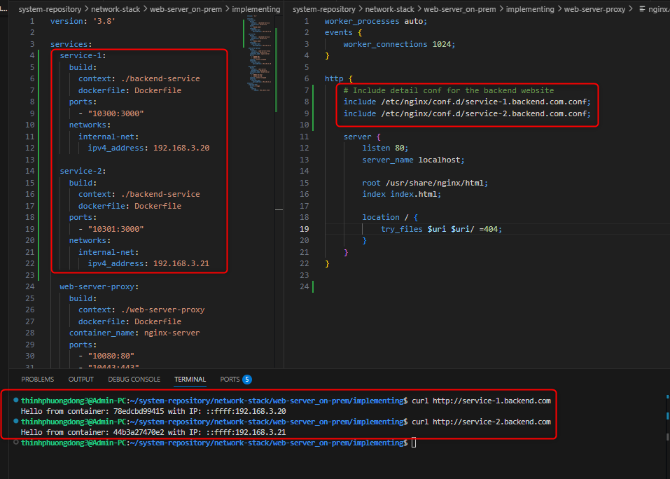
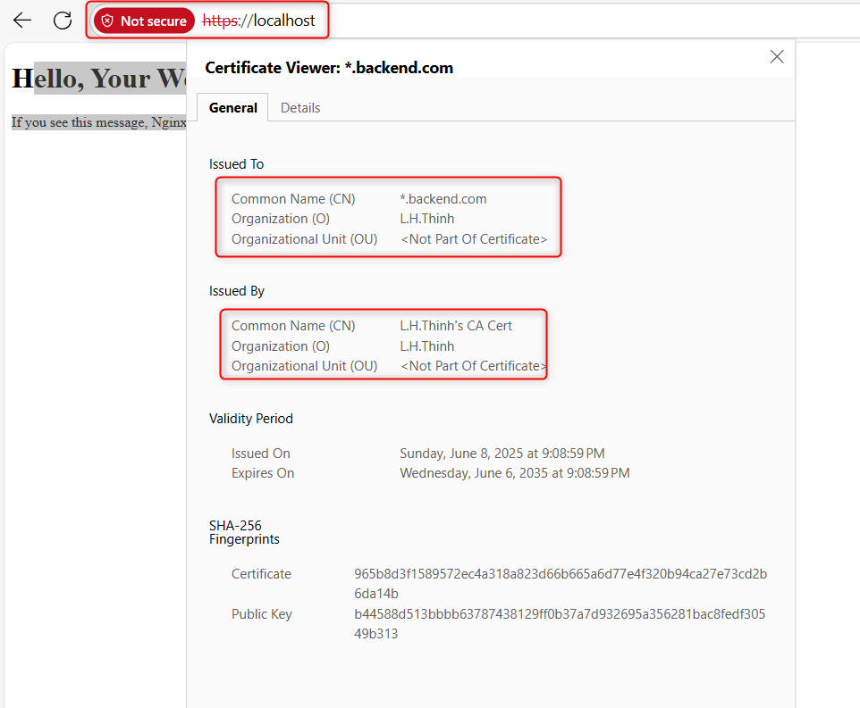
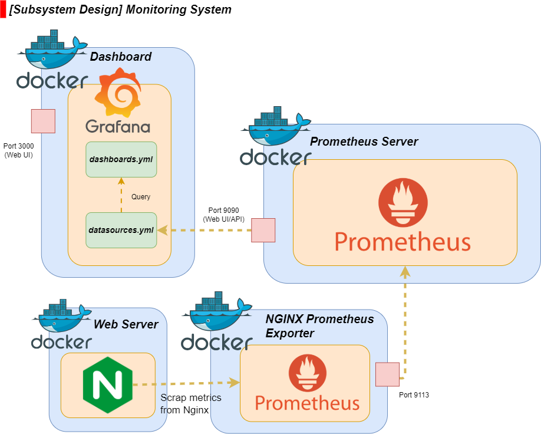

#  1. Web Server On-Prem

- [1. Web Server On-Prem](#1-web-server-on-prem)
  - [1.1. Version History](#11-version-history)
  - [1.2. Overview](#12-overview)
    - [1.2.1. Description](#121-description)
    - [1.2.2. Main Objectives](#122-main-objectives)
    - [1.2.3. Technology \& Components](#123-technology--components)
  - [1.3. Functional Requirements](#13-functional-requirements)
    - [1.3.1. **Web Server Core Functionality**](#131-web-server-core-functionality)
    - [1.3.2. **DNS Server (Bind9)**](#132-dns-server-bind9)
    - [1.3.3. **Proxy Server (Nginx)**](#133-proxy-server-nginx)
    - [1.3.4. **Security \& SSL/TLS**](#134-security--ssltls)
    - [1.3.5. **Monitoring \& Logging (Prometheus, ELK Stack)**](#135-monitoring--logging-prometheus-elk-stack)
    - [1.3.6. **Performance Optimization**](#136-performance-optimization)
    - [1.3.7. **Fault Tolerance \& High Availability**](#137-fault-tolerance--high-availability)
    - [1.3.8. **User Authentication \& Access Control**](#138-user-authentication--access-control)
    - [1.3.9. **Backup \& Disaster Recovery**](#139-backup--disaster-recovery)
    - [1.3.10. **10. API Gateway \& Microservices Support**](#1310-10-api-gateway--microservices-support)
  - [1.4. Non-functional Requirements](#14-non-functional-requirements)
  - [1.5. System Design](#15-system-design)
    - [1.5.1. Top Level Design](#151-top-level-design)
    - [1.5.2. Current provided hardware, software, and others:](#152-current-provided-hardware-software-and-others)
  - [1.6. Prerequisites for On-Premise Web Server Deployment](#16-prerequisites-for-on-premise-web-server-deployment)
    - [1.6.1. **Hardware Requirements**](#161-hardware-requirements)
    - [1.6.2. **Operating System \& Infrastructure**](#162-operating-system--infrastructure)
    - [1.6.3. **Web Server \& Proxy Setup**](#163-web-server--proxy-setup)
    - [1.6.4. **DNS Server Setup (Bind9)**](#164-dns-server-setup-bind9)
    - [1.6.5. **Security \& SSL/TLS**](#165-security--ssltls)
    - [1.6.6. **Monitoring \& Logging**](#166-monitoring--logging)
    - [1.6.7. **Database Setup (If Required)**](#167-database-setup-if-required)
    - [1.6.8. **Network Configuration**](#168-network-configuration)
    - [1.6.9. **Authentication \& Access Control**](#169-authentication--access-control)
    - [1.6.10. **Backup \& Disaster Recovery**](#1610-backup--disaster-recovery)
  - [1.7. Implementation](#17-implementation)
    - [1.7.1. **Web Server Core Functionality**](#171-web-server-core-functionality)
    - [1.7.2. **DNS Server (Bind9)**](#172-dns-server-bind9)
    - [1.7.3. **Proxy Server (Nginx)**](#173-proxy-server-nginx)
    - [1.7.4. **Security \& SSL/TLS**](#174-security--ssltls)
    - [1.7.5. **Monitoring \& Logging (Prometheus, ELK Stack)**](#175-monitoring--logging-prometheus-elk-stack)
    - [1.7.6. **Performance Optimization**](#176-performance-optimization)
    - [1.7.7. **Fault Tolerance \& High Availability**](#177-fault-tolerance--high-availability)
    - [1.7.8. **User Authentication \& Access Control**](#178-user-authentication--access-control)
    - [1.7.9. **Backup \& Disaster Recovery**](#179-backup--disaster-recovery)
    - [1.7.10. **API Gateway \& Microservices Support**](#1710-api-gateway--microservices-support)
  - [1.8. **References**](#18-references)

## 1.1. Version History

| Version | Release Date | Changes & Updates                      | Author    |
|---------|--------------|----------------------------------------|-----------|
| v0.4.1  | 12 June 2025 | Bind9 & DNS config for `*.backend.com` | L.H.Thinh |
|         |              | Nginx & reverse Proxy for services     |           |
|         |              | TLS Certification & CA cert for HTTPS  |           |
|         |              | Simple monitoring system               |           |

## 1.2. Overview

### 1.2.1. Description

This documentation outlines the design and implementation of a **web server with proxy (Nginx)**, a **DNS server (Bind9)**, **SSL/TLS security**, and **Prometheus monitoring** based on **SRE principles**.

### 1.2.2. Main Objectives

1. **Web Server Core Functionality**
2. **DNS Server (Bind9)**
3. **Proxy Server (Nginx)**
4. **Security & SSL/TLS**
5. **Monitoring & Logging (Prometheus, ELK Stack)**
6. **Performance Optimization**
7. **Fault Tolerance & High Availability**
8. **User Authentication & Access Control**
9. **Backup & Disaster Recovery**
10. **API Gateway & Microservices Support**

### 1.2.3. Technology & Components

- **Web Server & Proxy**: Nginx
- **DNS Server**: Bind9
- **Security**: SSL/TLS Certificates
- **Monitoring**: Prometheus
- **Infrastructure**: Docker, Linux
<!-- Insert Diagram here -->

## 1.3. Functional Requirements

### 1.3.1. **Web Server Core Functionality**
- **Serve Web Content**: Efficiently deliver web pages, static files, and dynamic content.
- **Reverse Proxy Support**: Handle incoming client requests and forward them to backend services.
- **Load Balancing**: Distribute traffic across multiple servers to improve performance.
- **Session Management**: Maintain user sessions for stateful applications.
- **Compression & Optimization**: Use **Gzip** or **Brotli** for faster content delivery.

### 1.3.2. **DNS Server (Bind9)**
- **Domain Resolution**: Convert human-readable domain names into IP addresses.
- **Zone Management**: Support authoritative zones and forward/reverse DNS lookups.
- **Caching & Forwarding**: Improve performance by caching DNS queries.
- **Security Policies**: Implement **DNSSEC** for protection against spoofing and attacks.

### 1.3.3. **Proxy Server (Nginx)**
- **Reverse Proxy**: Route requests to backend servers efficiently.
- **Forward Proxy**: Allow clients to access external sites while hiding their IP addresses.
- **Traffic Control**: Enforce rate limiting, request filtering, and access restrictions.
- **SSL/TLS Termination**: Manage encrypted traffic by terminating SSL/TLS at the proxy layer.

### 1.3.4. **Security & SSL/TLS**
- **SSL/TLS Encryption**: Implement HTTPS for secure communication.
- **Certificate Management**: Use **Let's Encrypt** or enterprise solutions for automatic renewal.
- **Firewall & Access Control**: Block unauthorized access and prevent common attacks.
- **Intrusion Detection & Prevention**: Monitor incoming traffic for malicious activity.

### 1.3.5. **Monitoring & Logging (Prometheus, ELK Stack)**
- **Resource Usage Monitoring**: Track **CPU, RAM, Disk usage** to prevent performance bottlenecks.
- **Traffic Analytics**: Monitor **request rates, error responses, and active connections**.
- **Log Management**: Store and analyze logs for troubleshooting and security auditing.
- **Automated Alerting**: Send alerts when anomalies or system failures occur.

### 1.3.6. **Performance Optimization**
- **Caching Mechanisms**: Use **Redis** or **Varnish** for faster content delivery.
- **Load Balancing Strategies**: Implement **round-robin, least connections, or IP hashing**.
- **Content Delivery Network (CDN)**: Optionally integrate with **Cloudflare** or **Akamai** for global scaling.

### 1.3.7. **Fault Tolerance & High Availability**
- **Redundant Infrastructure**: Ensure failover support in case of hardware failure.
- **Automatic Recovery**: Detect server failures and reroute traffic to operational nodes.
- **Database Replication**: Use **MySQL/MariaDB/PostgreSQL** replication for high availability.

### 1.3.8. **User Authentication & Access Control**
- **Identity & Access Management**: Use **OAuth, LDAP, or Kerberos** for authentication.
- **Role-Based Access Control (RBAC)**: Define permissions for different user roles.
- **Multi-Factor Authentication (MFA)**: Enhance security for administrative access.

### 1.3.9. **Backup & Disaster Recovery**
- **Scheduled Data Backup**: Ensure regular snapshots and database dumps.
- **Disaster Recovery Plan**: Implement recovery strategies for minimal downtime.
- **Automatic Failover**: Redirect services to backup servers when failures occur.

### 1.3.10. **10. API Gateway & Microservices Support**
- **API Rate Limiting**: Control how frequently APIs can be accessed.
- **Request Routing**: Direct API requests to correct backend services.
- **Authentication & Security**: Implement **JWT-based authentication** for APIs.

## 1.4. Non-functional Requirements

**Table of design non-functional criteria**

| **Criteria**          | **Definition** | **Metrics to measured** | **Note**   |
|-----------------------|----------------|-------------------------|------------|
| **Scalability**       | Ability to handle increased traffic | Requests per second, CPU/memory usage | Auto-scaling enabled |
| **Reliability**       | System stability over time | Downtime percentage, error rate | Redundant architecture |
| **Availability**      | Ensuring uptime and accessibility | Uptime percentage, failover success rate | Multi-zone deployment |
| **Performance**       | Speed and efficiency of operations | Response time, throughput | Optimized caching and load balancing |
| **Security**          | Protection against threats | SSL/TLS encryption, vulnerability scans | Regular security audits |
| **Maintainability**   | Ease of updates and troubleshooting | Code modularity, documentation quality | Automated CI/CD pipelines |
| **Fault Tolerance**   | Ability to recover from failures | Recovery time, redundancy level | Backup and failover mechanisms |
| **Observability**     | System monitoring and logging | Metrics collection, alerting | Prometheus and Grafana integration |
| **Usability**         | User experience and accessibility | UI/UX feedback, accessibility compliance | Intuitive interfaces |
| **Interoperability**  | Compatibility with other systems | API standards, protocol support | RESTful APIs, DNS integration |
| **Energy Efficiency** | Resource optimization | Power consumption, CPU efficiency | Green computing practices |

## 1.5. System Design

### 1.5.1. Top Level Design

The system consists of an **Nginx web server with reverse proxy**, a **Bind9 DNS server**, **SSL/TLS encryption**, and **Prometheus monitoring** for observability.

### 1.5.2. Current provided hardware, software, and others:

- **Hardware**: On-premise servers
- **Software**: Linux, Docker
- **Networking**: Load balancers, firewalls, DNS configurations

## 1.6. Prerequisites for On-Premise Web Server Deployment

### 1.6.1. **Hardware Requirements**
- **Server Machines**: Bare-metal or virtualized servers for hosting web services.
- **Storage**: SSD/NVMe recommended for fast read/write operations.
- **Network Equipment**: Routers, switches, and firewalls for connectivity and security.
- **Power Backup**: UPS or redundant power supply to avoid downtime.

### 1.6.2. **Operating System & Infrastructure**
- **Linux Distribution**: Ubuntu, Debian, CentOS, or Rocky Linux.
- **Containerization (Optional)**: Docker or Kubernetes for microservices.
- **Virtualization Support**: VMware, KVM, or VirtualBox if using VMs.

### 1.6.3. **Web Server & Proxy Setup**
- **Nginx Installation**: Web server and reverse proxy role.
- **Domain Configuration**: Ensure domain/subdomain registration for hosting.
- **Reverse Proxy Rules**: Define backend request forwarding setup.

### 1.6.4. **DNS Server Setup (Bind9)**
- **Bind9 Installation**: Install and configure DNS server.
- **Zone Files**: Define authoritative DNS records.
- **DNSSEC Implementation**: Enhance security for DNS queries.

### 1.6.5. **Security & SSL/TLS**
- **SSL Certificates**: Generate using Let's Encrypt or enterprise CA.
- **Firewall Rules**: Configure iptables or UFW for access control.
- **Fail2Ban & IDS**: Implement security hardening and intrusion detection.

### 1.6.6. **Monitoring & Logging**
- **Prometheus Installation**: Set up metrics collection for observability.
- **Grafana Dashboard**: Configure visual monitoring interface.
- **ELK Stack Deployment**: Elasticsearch, Logstash, and Kibana for logging.

### 1.6.7. **Database Setup (If Required)**
- **Database Server**: MySQL, PostgreSQL, MariaDB, or MongoDB.
- **Replication & Backup**: Configure data redundancy and periodic snapshots.
- **Query Optimization**: Indexing and caching for performance tuning.

### 1.6.8. **Network Configuration**
- **Static IP & NAT Setup**: Assign fixed IP addresses to servers.
- **Load Balancer (Optional)**: Use HAProxy or Nginx for balanced traffic distribution.
- **Internal & External DNS Records**: Ensure hostname resolution is properly mapped.

### 1.6.9. **Authentication & Access Control**
- **User Management**: Implement **RBAC** and **LDAP** authentication.
- **API Security**: Use JWT-based authorization for web applications.
- **Multi-Factor Authentication (MFA)**: Enforce strong authentication policies.

### 1.6.10. **Backup & Disaster Recovery**
- **Snapshot & Data Backup**: Schedule regular backups of system configurations.
- **Failover Configuration**: Implement automatic failover mechanisms.
- **Disaster Recovery Plan**: Define procedures for critical incident handling.

## 1.7. Implementation
### 1.7.1. **Web Server Core Functionality**

**Description**:
A web server that efficiently serves static and dynamic content, supports **reverse proxy**, **load balancing**, and ensures optimal session management.

**Implementing**:
- Install **Nginx** as the web server on Docker container (IP address: `192.168.3.10`)
  - Implemented in `implementing/docker-compose.yaml`
  - Detail container is found in `implementing/web-server-proxy/`
   
- Configure **reverse proxy** settings for backend services.
  - Create two dummy backend container with the dockerfile in `implementing/backend-service`
  - Create two `service-1.backend.com.conf` and `service-2.backend.com.conf` in `implementing/web-server-proxy/` as reverse proxy for two backend services

- Implement **load balancing** with round-robin and least-connections strategies.
- Enable **Gzip compression** for optimized content delivery.

**Validating**:
- Perform **load tests** using Apache Benchmark (`ab`).
- Measure **response time** and **throughput** under stress.
- Verify **session handling and persistence** using cookies.

**Result**:
- Web server successfully deployed with **high performance** and **efficient resource utilization**.
- Ensured **fast and optimized content delivery**.

### 1.7.2. **DNS Server (Bind9)**

**Description**:
A **DNS server** that resolves domain names to IP addresses efficiently, ensuring caching, security, and zone management.

**Design Diagram**

**Implementing**:
- Install **Bind9** DNS server on Docker container (IP address: `192.168.3.11`)
  - Implemented in `implementing/docker-compose.yaml`
  - Detail container is found in `implementing/dns-server/`
  
- Configure **zone files** for domain resolution:
  - Implemented in  `implementing/dns-server/db.backend.com` for backend domain
  - Implemented in  `implementing/dns-server/db..internal-infra.com` for other devops infra domain

- Enable **DNS caching** for fast responses.

- Implement **DNSSEC** for security.

**Validating**:
- Test domain resolution with `nslookup` and `dig`.

- Verify caching mechanism and query response times.
- Ensure proper failover with secondary DNS.

**Result**:
- **Bind9** successfully deployed with **accurate and secure DNS resolution**.
- Improved **query performance** and **network efficiency**.

### 1.7.3. **Proxy Server (Nginx)**

**Description**:
The proxy server manages **forward and reverse proxy requests**, **SSL/TLS termination**, and **traffic control**.

**Design Diagram**

**Implementing**:
- Configure **Nginx** for **reverse proxy** routing
  - The configuration for reverse proxy routing is implemented in `implementing/web-server-proxy/nginx.conf`
  - The configuration for service-1 routing is implemented in `implementing/web-server-proxy/service-1.backend.com.conf`
  - The configuration for service-2 routing is implemented in `implementing/web-server-proxy/service-2.backend.com.conf`

- Set up **SSL termination** to handle HTTPS requests.
  - The SSL cert for the domain `*.backend.com` is implemented in `implementing/web-server-proxy/nginx-conf/ssl/ssl-backend.com.conf`

- Apply **rate limiting and request filtering**.

**Validating**:
- Verify **proxy functionality** with test requests.

- Ensure SSL/TLS encryption is properly configured using `openssl s_client`.

- Monitor **traffic handling and load balancing performance**.

**Result**:
- Nginx proxy successfully routes requests **securely and efficiently**.
- Enabled **high-performance traffic distribution**.

### 1.7.4. **Security & SSL/TLS**

**Description**:
Secure communication via **SSL/TLS**, preventing data interception and unauthorized access.

**Implementing**:
- Generate SSL certificates with OpenSSL.
  - Generate SSL certificates with own `openssl` in the `implementing/ssl-certification/openssl.sh`
  - `implementing/ssl-certification/ca.crt` and `implementing/ssl-certification/ca.key` is the product of openSSL (the CA cert and key stored in this are only example, no security risk to web)
  
- Configure **Nginx** to enforce HTTPS connections.
  - Implemented in `implementing/web-server-proxy/nginx-conf/router.conf` as the HTTP request from client will always redirect to HTTPS.

- Implement **HSTS and strong cipher suites**.

**Validating**:
- Test SSL certificate validity using `openssl`.
- Run security scans with **Qualys SSL Labs**.
- Verify compliance with industry standards.

**Result**:
- **End-to-end encrypted connections established**.
- Improved security posture and **data protection**.

### 1.7.5. **Monitoring & Logging (Prometheus, ELK Stack)**

**Description**:
System monitoring using **Prometheus** for metrics collection and **ELK Stack** for centralized logging.

**Design Diagram**

**Implementing**:
- Install **Prometheus** and configure **Nginx exporter**.
  - Implemented **Prometheus** in `implementing/monitoring/prometheus`
  - Implemented **Nginx exporter** in `implementing/docker-compose.yaml`  (The service: `nginx-exporter`)
  - Add the `location /stub_status` in `implementing/web-server-proxy/nginx-conf/router.conf`

- Set up **Grafana dashboards** for visualization.
  - Implemented **Grafana** in `implementing/monitoring/grafana`
  - Implemented **Grafana dashboards** in `implementing/monitoring/grafana/dashboards` and `implementing/monitoring/grafana/dashboards.yml`

- Integrate **Elasticsearch, Logstash, Kibana (ELK)** for centralized logging.

**Validating**:
- Verify metric collection using Prometheus queries.
- Test Grafana alerts and dashboards.
- Check log indexing and search performance.

**Result**:
- Successfully implemented **comprehensive monitoring and observability**.
- Improved **system health visibility**.

### 1.7.6. **Performance Optimization**

**Description**:
Optimizing system performance through **caching, load balancing, and CDN integration**.

**Implementing**:
- Configure **Redis** caching for dynamic content.
- Optimize **load balancing algorithms** for efficient request handling.
- Implement **CDN integration** if applicable.

**Validating**:
- Perform **stress testing** for response time evaluation.
- Validate **cache hit ratio** with Redis metrics.
- Check **CDN acceleration performance**.

**Result**:
- Performance enhancements led to **faster response times** and **efficient resource utilization**.

### 1.7.7. **Fault Tolerance & High Availability**

**Description**:
Ensuring system reliability through **redundancy, failover, and automatic recovery mechanisms**.

**Implementing**:
- Deploy **failover DNS** configuration.
- Implement **database replication** across multiple servers.
- Set up **auto-recovery scripts** for service failures.

**Validating**:
- Test **failover behavior** using simulated outages.
- Check database replication consistency.
- Ensure **auto-recovery triggers** activate correctly.

**Result**:
- Achieved **high availability and fault tolerance** with minimal downtime.

### 1.7.8. **User Authentication & Access Control**

**Description**:
Enforcing **secure access control mechanisms** using authentication and role-based permissions.

**Implementing**:
- Configure **OAuth, LDAP**, or **Kerberos** authentication.
- Apply **RBAC (Role-Based Access Control)**.
- Enable **MFA (Multi-Factor Authentication)**.

**Validating**:
- Test authentication workflows.
- Verify permission enforcement for different user roles.
- Assess MFA authentication success rates.

**Result**:
- **Secure and controlled access** implemented successfully.

### 1.7.9. **Backup & Disaster Recovery**

**Description**:
Ensuring **data resilience** through scheduled backups and automatic failover mechanisms.

**Implementing**:
- Set up **automated backup scripts** for periodic snapshots.
- Implement **database failover policies**.
- Define **disaster recovery procedures**.

**Validating**:
- Restore data from backups to test integrity.
- Simulate disaster recovery scenarios.
- Validate failover success rates.

**Result**:
- **Reliable backup strategies and disaster recovery** in place.

### 1.7.10. **API Gateway & Microservices Support**

**Description**:
Providing **API routing, security, and rate-limiting mechanisms** for microservices communication.

**Implementing**:
- Deploy **API gateway** (e.g., Kong, Nginx, Traefik).
- Apply **JWT authentication** for secure access.
- Set up **rate-limiting** to control API usage.

**Validating**:
- Verify **API routing and authentication** flows.
- Test rate-limiting enforcement under high traffic.
- Ensure microservices **interoperability**.

**Result**:
- API gateway successfully handles **secure and optimized** requests.

## 1.8. **References**

* [BIND9 Configuration Guide](https://wiki.debian.org/Bind9)
* [NGINX Docs - Server Blocks](https://nginx.org/en/docs/http/server_names.html)
* [NGINX Reverse Proxy Setup](https://docs.nginx.com/nginx/admin-guide/web-server/reverse-proxy/)
