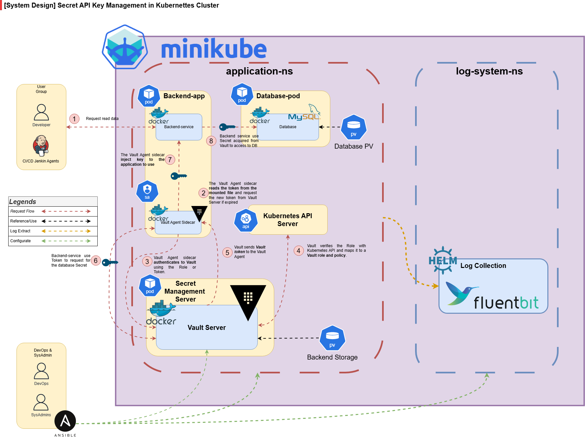
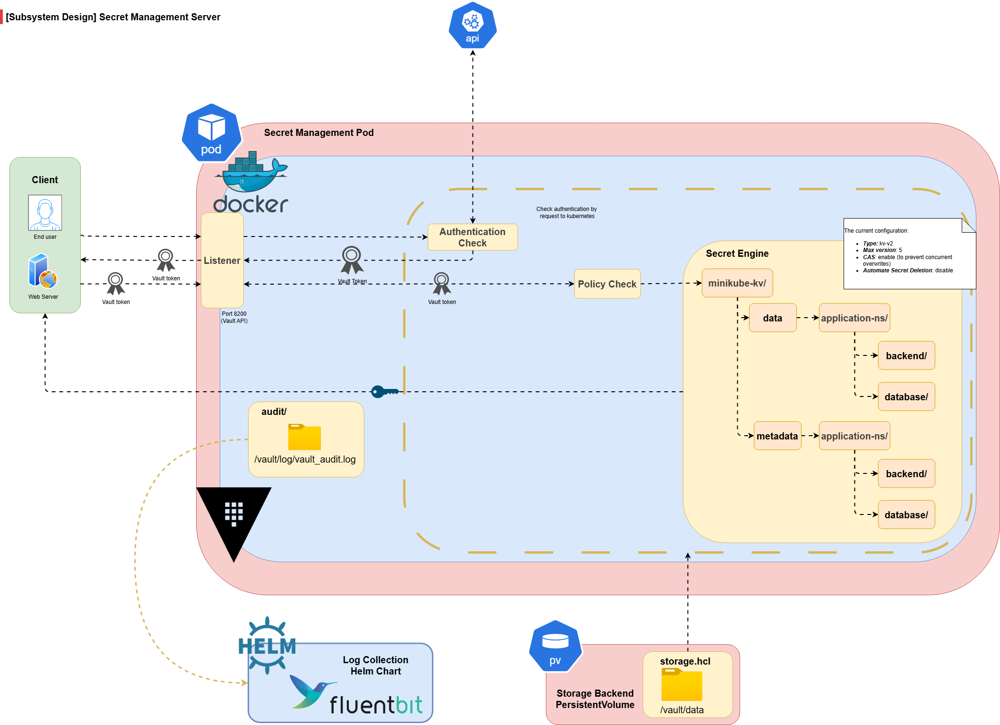

# Secure API Key Management with Vault & Kubernetes Integration

## Version History

| Version | Release Date | Changes & Updates              | Author    |
| ------- | ------------ | -------------------------------| --------- |
| v0.3.1  | 13 June 2025 | 1. Vault Server & Agent setup  | L.H.Thinh |
|         |              | 2. Ansible for configuration   |           |
|         |              | 3. Backend service can extract |           |
|         |              |    macro in `.env` injected    |           |
|         |              |    from Vault Agent            |           |

## Overview

### Description

This project implements a secure API key management system using HashiCorp Vault integrated with Kubernetes. The goal is to prevent hardcoding secrets in application code or configuration files by using dynamic secret injection and policy-based access controls. Vault acts as a centralized secret management service, while Kubernetes facilitates containerized deployment and workload identity via service accounts.

## Functional Requirements

### Vault Secret Management

* **Dynamic Secrets:** Support on-demand generation of secrets (e.g., AWS keys, DB credentials).
* **Static Secrets Storage:** Securely store API keys, passwords, and certificates.
* **Policy-Based Access Control:** Grant access based on identity with fine-grained Vault policies.
* **Audit Logging:** Record all secret access and operations for traceability.
* **Secret Expiry & Revocation:** Enforce TTL and allow revocation of secrets as needed.

### Kubernetes Integration

* **Service Account Identity:** Use Kubernetes service accounts as identity for authentication to Vault.
* **Vault Agent Sidecar Injection:** Deploy sidecar containers that authenticate and retrieve secrets automatically.
* **Environment Variable/Volume Injection:** Support for injecting secrets into app containers via env vars or mounted files.
* **Auto-Renewal:** Automatically renew Vault tokens and leased secrets before expiration.
* **Pod Annotation for Injection:** Allow fine-grained control over which pods receive secrets via annotations.

### Authentication & Authorization

* **Kubernetes Auth Method:** Validate service account JWT with Kubernetes API server.
* **Role Binding:** Map Kubernetes service accounts to Vault roles using namespaces and service account names.
* **Token Scoping:** Ensure Vault tokens issued are scoped to minimum necessary permissions.
* **Secure Mounting:** Use Kubernetes secrets or CSI drivers securely for provisioning Vault configurations.
* **Multi-Tenant Support:** Support different policies per namespace, enabling secure multi-team usage.

### Application Secret Access

* **Zero Trust Secret Fetching:** Applications must not assume access to any secret without proper identity.
* **Transparent Access:** Secrets are made available to apps with no hardcoded logic for fetching them.
* **Secrets at Runtime:** Applications access secrets only when required, minimizing exposure time.
* **Error Handling & Failover:** Provide error messages or fallback if Vault or secret access fails.
* **Minimal Blast Radius:** Ensure secrets are accessible only within the context of a single workload or namespace.

### Logging System

* **Audit Log Integration:** Vault must log all operations including authentication, secret access, token issuance, and revocation.
* **Per-Request Traceability:** Each secret access should include metadata such as service account, namespace, pod identity, and timestamp.
* **Centralized Log Collection:** All Vault and Vault Agent logs should be shippable to a centralized logging backend (e.g., ELK stack, Loki, or Fluentd).
* **Log Rotation & Retention:** Support log rotation policies and configurable retention to manage disk usage.
* **Error Visibility:** Logs must capture failed authentication, policy violations, and Vault unavailability with meaningful context.
* **Sidecar Log Access:** Vault Agent sidecar must expose logs to the application namespace for inspection and troubleshooting.
* **Alert Integration:** Integrate with monitoring tools (e.g., Prometheus Alertmanager) to trigger alerts on anomalous activity or failures in authentication/renewal.
* **Minimal Sensitive Leakage:** Logs must redact or omit sensitive data such as token values, secrets, and credentials.
* **Debug Mode Support:** Allow enabling verbose logs for troubleshooting during development or testing without exposing secrets.

### Ansible Integration

* **Automated Vault Configuration:** Use Ansible playbooks to automate the setup of Vault policies, auth methods, secrets engines, and AppRoles.
* **Dynamic Secret Provisioning:** Enable Ansible tasks to fetch dynamic secrets (e.g., DB credentials, cloud API tokens) from Vault at runtime for use in deployments.
* **Vault Lookup Plugin:** Leverage Ansible's `hashi_vault` lookup plugin to securely access secrets from Vault without hardcoding credentials in playbooks.
* **Role-Based Execution:** Restrict playbook access to secrets via AppRole or Token auth methods, ensuring least-privilege principle.
* **Secret Templating:** Inject secrets into templated config files (e.g., `.env`, `kubeconfig`, `config.yaml`) using `jinja2` + Vault integration.
* **Auditable Deployments:** Ensure all Vault access via Ansible is logged and traceable via Vault’s audit log.
* **Error Handling:** Implement fail-fast behavior if secrets cannot be retrieved, with clear messaging and fallback support.

### Technology & Components

* HashiCorp Vault
* Kubernetes (v1.20+)
* Vault Agent Injector / Sidecar
* Kubernetes Secrets (for auth token)
* Docker
* CI/CD pipeline (GitLab CI, Jenkins, or GitHub Actions — optional)
* Ansible

## Design

### Top Level Architecture

This design leverages Kubernetes service accounts for identity, Vault for secure secret storage and access, and Vault Agent as a sidecar to handle secret injection. The application pod does not manage secrets directly but relies on Vault’s policy engine and Kubernetes-native authentication.



## Prerequisites

* Kubernetes cluster with RBAC enabled
* Vault installed and accessible (Helm chart or standalone)
* Vault initialized and unsealed
* Kubernetes service account for the app
* Vault policies created and mapped to service account
* Application deployment manifest with sidecar injector annotations
* Vault CLI and kubectl installed locally

## Implementation

## Vault Secret Management

**Design Diagram**



**Implementing**:

* Vault Secret Management Server installation and configuration:
  * Implemented **installation** for **Vault Server** in `implementing/secret-management`
  * Implemented **configuration** for **Vault Server** in `implementing/configuration-management/roles/vault-server/tasks/localhost_vault-server-setup.yml`

* Enable and configure Vault secret engines (KV):
  * Implemented **configuration** for **Vault secret engines (KV)** in `implementing/configuration-management/roles/vault-server/tasks/localhost_secrets-and-policies.yml`

* Write static secrets to defined KV paths.
  * Implemented **configuration** for **Vault secret engines (KV)** in `implementing/configuration-management/roles/vault-server/tasks/localhost_secrets-and-policies.yml`
  
* Create Vault policies that restrict access to specific paths and operations.
  * Implemented **configuration** for **Vault secret engines (KV)** in `implementing/configuration-management/roles/vault-server/tasks/localhost_secrets-and-policies.yml`

* Define secret paths and associated TTLs and max TTLs.

* Enable audit logging and configure file or syslog backends.

**Validating**:

* Use `vault kv get` and `vault kv put` to test secret storage/retrieval.
* Confirm TTL enforcement using `vault lease lookup`.
* Inspect Vault audit logs for access attempts.
* Verify access denial for unauthorized identities.

---

## Kubernetes Integration

**Design Diagram**


**Implementing**:

* Enable Kubernetes auth method in Vault using:

  ```bash
  vault auth enable kubernetes
  ```
* Configure Vault to trust Kubernetes cluster using service account JWT and CA cert.
* Create Vault roles mapping Kubernetes service accounts to Vault policies.
* Annotate deployment YAMLs with Vault injector sidecar annotations.
* Deploy Vault Agent injector as a mutating admission webhook.

**Validating**:

* Confirm injector adds sidecars using `kubectl describe pod`.
* Use `vault login -method=kubernetes` with service account token to verify auth flow.
* Check logs of the Vault Agent for successful token acquisition and secret retrieval.
* Confirm pod runs with secret file or env var as expected.

---

## Authentication & Authorization

**Design Diagram**


**Implementing**:

* Bind Vault policies to service accounts via `vault write auth/kubernetes/role/...`.
* Use `vault policy write` to define least-privilege policies.
* Rotate or revoke tokens manually or on TTL expiration.
* Enforce strict namespace + service account matching in role bindings.

**Validating**:

* Attempt access with a non-matching service account — should be denied.
* Validate issued Vault token scope with `vault token lookup`.
* Attempt to access restricted secret paths — expect `permission denied`.
* Inspect Vault role list and mappings for consistency.

---

## Application Secret Access

**Design Diagram**
(Part of application pod block in the overall architecture diagram.)

**Implementing**:

* Annotate deployment YAML to request specific secrets via the Vault Agent injector.


* Use `template_config` block to specify secret path and target injection location (env var or volume).

* Ensure shared volume is used between sidecar and app container when writing files.
  

* Enable auto-renewal of secrets using `vault.agent.config` renewal settings.

**Validating**:

* Log into application container and check access to secret via env or file.
* Observe auto-renewal by monitoring token TTL in sidecar logs.
* Validate secrets are not visible in Kubernetes Secrets or pod manifests.
* Simulate Vault unavailability to test failover and logging behavior.


## References

* [Vault Kubernetes Auth](https://developer.hashicorp.com/vault/docs/auth/kubernetes)
* [Vault Agent Sidecar Injector](https://developer.hashicorp.com/vault/docs/platform/k8s/injector)
* [Vault Helm Chart](https://github.com/hashicorp/vault-helm)
* [Best Practices for Managing Secrets with Vault](https://developer.hashicorp.com/vault/docs/best-practices)
* [Kubernetes Official Docs](https://kubernetes.io/docs/home/)

